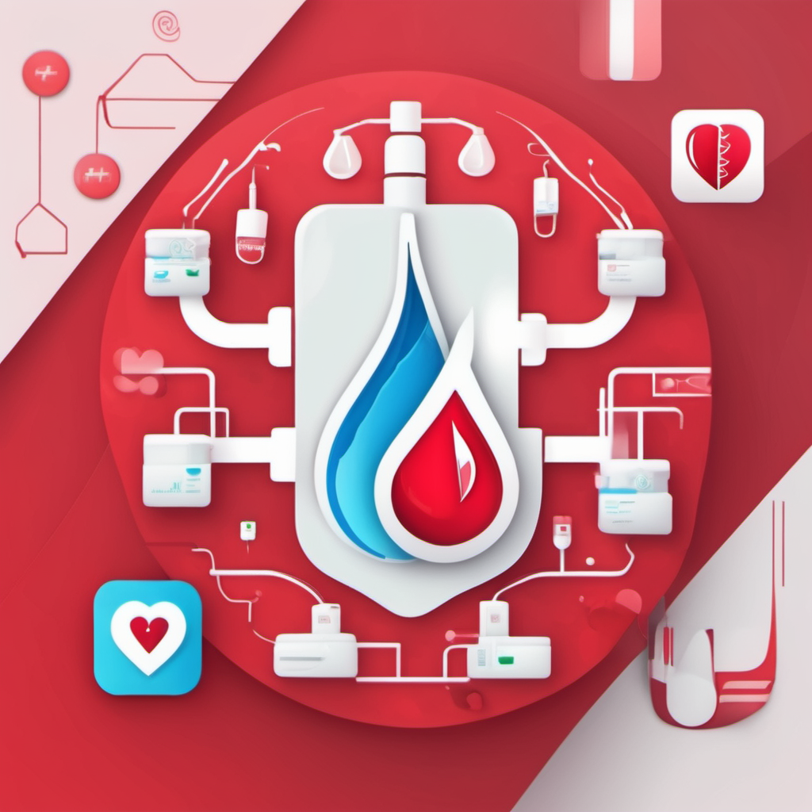
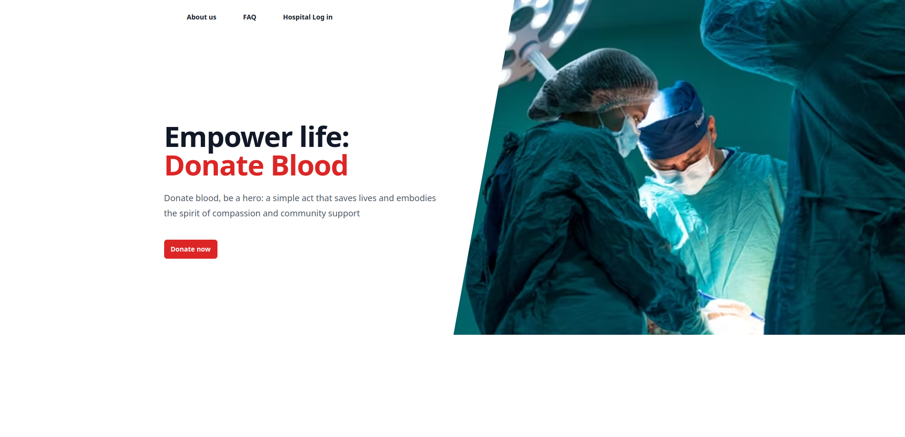

# Blood Donation App



## Overview

The Blood Donation App is a comprehensive web application developed to facilitate blood donation coordination between donors and hospitals. Built using React, Tailwind CSS, Flask, and MySQL, the app allows donors to register, schedule appointments, and hospitals to manage blood donation activities.

## Table of Contents

- [Features](#features)
- [Technologies Used](#technologies-used)
- [Database Schema](#database-schema)
- [Team Members](#team-members)
- [Getting Started](#getting-started)
- [Running the App](#running-the-app)
- [Acknowledgments](#acknowledgments)

## Features

- **User Authentication:** Secure registration and authentication system for both donors and hospitals.
- **Donor Management:** Donors can register, provide contact details, and select their blood group.
- **Hospital Dashboard:** Hospitals have access to a dedicated dashboard for managing donor appointments.
- **Appointment Scheduling:** Donors can schedule appointments, and hospitals can view and manage appointments.
- **Responsive Design:** A visually appealing and responsive design for seamless user experience across devices.



## Technologies Used

- **React:** A JavaScript library for building user interfaces.
- **Tailwind CSS:** A utility-first CSS framework for styling the application.
- **Flask:** A Python web framework used for the server-side development.
- **MySQL:** A relational database management system for storing donor and hospital data.

## Database Schema

The app uses two tables in the MySQL database:

### Hospital Table

```sql
CREATE TABLE hospital (
    hospital_id INT AUTO_INCREMENT PRIMARY KEY,
    hospital_name VARCHAR(255) NOT NULL,
    email VARCHAR(255) NOT NULL,
    password VARCHAR(255) NOT NULL
);
```

### Donor Table


```sql
CREATE TABLE donor (
    donor_id INT AUTO_INCREMENT PRIMARY KEY,
    name VARCHAR(255) NOT NULL,
    phone VARCHAR(20) NOT NULL,
    blood_group VARCHAR(5) NOT NULL
);
```

# Team Members

- Harishankar R ([@H4rish4nk4r](https://github.com/H4rish4nk4r))
- Harishankar Manoj ([@Hari2k3](https://github.com/Hari2k3))
- Gowrishankar H
- Gouri Vinod
- Geeves

# Getting Started

1. **Clone the repository:**

    ```bash
    git clone https://github.com/your-username/blood-donation-app.git
    cd blood-donation-app
    ```

2. **Install dependencies:**

    ```bash
    cd server
    pip install -r requirements.txt
    ```

    ```bash
    cd client
    npm install
    ```

3. **Set up MySQL database:**

    - Create a MySQL database and execute the table creation commands from the [Database Schema](#sql) section.

4. **Configure Flask:**

    - Update the database configuration in `app/config.py`.

5. **Run the application:**

    ```bash
    cd server
    python run.py
    ```

    ```bash
    cd client
    npm start
    ```

6. **Visit the application:**

    Open your web browser and go to [http://localhost:3000](http://localhost:3000) to view the app.

# Running the App

1. **Run the Flask server:**

    ```bash
    cd server
    python run.py
    ```

2. **Run the React app:**

    ```bash
    cd client
    npm start
    ```

    Open your web browser and visit [http://localhost:3000](http://localhost:3000) to access the application.


# Acknowledgments

- Special thanks to contributors who have participated in the development of this project.
- Inspirational quote or message.

